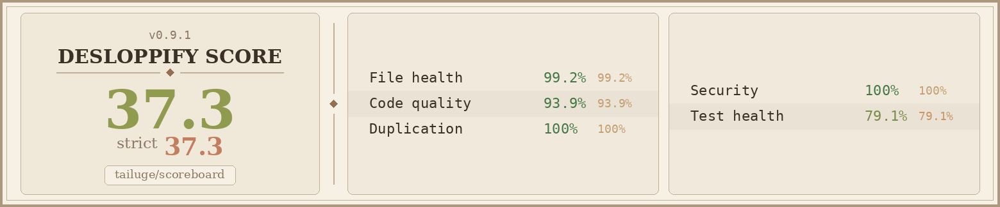

  Excluding (from config): .git, public/playwright-report, node_modules, .next
  Zones: production: 84, test: 64
  [1/14] Logs...
         0 instances → 0 issues
  [2/14] Unused (tsc)...
         0 instances -> 0 issues
  [3/14] Dead exports...
         0 instances → 0 issues
  [4/14] Deprecated...
         0 instances → 0 issues (properties suppressed)
  [5/14] Structural analysis...
         -> 1 structural issues
         flat dirs: 3 overloaded directories (files/subdirs/combined)
  [6/14] Coupling + single-use + patterns + naming...
         single-use: 10 found, 6 suppressed (50-200 LOC, 1 co-located)
         orphaned: 2 files with zero importers
         → 8 coupling/structural issues total
  [7/14] Responsibility cohesion...
  [8/14] Signature analysis...
  [9/14] Test coverage...
         test coverage: 17 issues (588 production files)
  [10/14] Code smells...
         -> 99 smell issues
         react: 1 state sync anti-patterns
  [11/14] Security...
         security: clean (84 files scanned)
  [12/14] Subjective review...
         subjective review: 64 issues (63 reviewable files)
  [13/14] Boilerplate duplication...
         zones: 6 boilerplate clusters excluded
  [14/14] Duplicates...
         zones: 44 functions excluded (non-production)
         0 clusters, 0 suppressed (<10 LOC)

  Total: 193 issues
  → query.json updated

Desloppify Scan (typescript)

  Plan: 20 unscored subjective dimension(s) queued for initial review.
  Scan complete
  ──────────────────────────────────────────────────
  +193 new
  ⚠ Skipped auto-resolve for: review (returned 0 — likely transient)
  Scores: overall 37.3/100 (+37.3)  objective 93.2/100 (+93.2)  strict 37.3/100 (+37.3)  verified 93.2/100 (+93.2)
  ⚠ 20 subjective dimensions are unassessed (scored as 0). The strict score currently reflects only mechanical detectors (40% of score weight). Run `desloppify review --prepare` to assess.
  Score guide:
    overall  = 40% mechanical + 60% subjective (lenient — ignores wontfix)
    objective = mechanical detectors only (no subjective review)
    strict   = like overall, but wontfix counts against you  <-- your north star
    verified = strict, but only credits scan-verified fixes
  Strict 37.3 (target: 95.0)
  * 150 issues hidden (showing 10/detector). Use `desloppify show <detector>` to see all.
  Scorecard dimensions (matches scorecard.png):
  File health        ███████████████  99.2%  (strict  99.2%)
  Code quality       ██████████████░  93.9%  (strict  93.9%)
  Duplication        ███████████████ 100.0%  (strict 100.0%)
  Security           ███████████████ 100.0%  (strict 100.0%)
  Test health        ████████████░░░  79.1%  (strict  79.1%)

  Score recipe:
    overall = 40% mechanical + 60% subjective
    Pool averages: mechanical 93.2% · subjective 0.0%
    Biggest weighted drags:
      - High elegance: -10.73 pts (score 0.0%, 17.9% of subjective pool)
      - Mid elegance: -10.73 pts (score 0.0%, 17.9% of subjective pool)
      - Type safety: -5.85 pts (score 0.0%, 9.8% of subjective pool)
      - Contracts: -5.85 pts (score 0.0%, 9.8% of subjective pool)
      - Low elegance: -5.85 pts (score 0.0%, 9.8% of subjective pool)

  193 new issues with few resolutions — likely cascading.

  → First scan complete. 193 open issues across 3 dimensions.
  Run `desloppify next` for the highest-priority item.
  Run `desloppify plan` to see the updated living plan.
  Run `desloppify status` for the full dashboard.

  Scorecard → scorecard.png
  💡 Ask the user if they'd like to add it to their README with:
     
     (disable: --no-badge | move: --badge-path <path>)
  Excluding (from config): .git, public/playwright-report, node_modules, .next
# Desloppify Plan — 2026-03-07

**Health:** overall 37.3/100 | objective 93.2/100 | strict 37.3/100 | 193 open | 0 fixed | 0 wontfix | 0 auto-resolved

148 files · 11K LOC · 20 directories

## Health by Dimension

| Dimension | Tier | Checks | Issues | Health | Strict | Action |
|-----------|------|--------|--------|--------|--------|--------|
| Code quality | T3 | 506 | 56 | 93.9% | 93.9% | autofix |
| Security | T4 | 169 | 0 | 100.0% | 100.0% | move |
| File health | T3 | 84 | 1 | 99.2% | 99.2% | refactor |
| Duplication | T3 | 79 | 0 | 100.0% | 100.0% | refactor |
| **Test health** | T4 | 651 | 81 | 79.1% | 79.1% | refactor |

- **193 open** / 193 total (0% addressed)

---
## User-Ordered Queue (20 items)

### Cluster: auto/initial-review
> Initial review of 20 unscored subjective dimensions

- [ ] [medium] Subjective dimension below target: Abstraction fit (0.0%)
      `subjective::abstraction_fitness`
- [ ] [medium] Subjective dimension below target: AI generated debt (0.0%)
      `subjective::ai_generated_debt`
- [ ] [medium] Subjective dimension below target: API coherence (0.0%)
      `subjective::api_surface_coherence`
- [ ] [medium] Subjective dimension below target: Auth consistency (0.0%)
      `subjective::authorization_consistency`
- [ ] [medium] Subjective dimension below target: Contracts (0.0%)
      `subjective::contract_coherence`
- [ ] [medium] Subjective dimension below target: Convention drift (0.0%)
      `subjective::convention_outlier`
- [ ] [medium] Subjective dimension below target: Cross-module arch (0.0%)
      `subjective::cross_module_architecture`
- [ ] [medium] Subjective dimension below target: Dep health (0.0%)
      `subjective::dependency_health`
- [ ] [medium] Subjective dimension below target: Design coherence (0.0%)
      `subjective::design_coherence`
- [ ] [medium] Subjective dimension below target: Error consistency (0.0%)
      `subjective::error_consistency`
- [ ] [medium] Subjective dimension below target: High elegance (0.0%)
      `subjective::high_level_elegance`
- [ ] [medium] Subjective dimension below target: Stale migration (0.0%)
      `subjective::incomplete_migration`
- [ ] [medium] Subjective dimension below target: Init coupling (0.0%)
      `subjective::initialization_coupling`
- [ ] [medium] Subjective dimension below target: Logic clarity (0.0%)
      `subjective::logic_clarity`
- [ ] [medium] Subjective dimension below target: Low elegance (0.0%)
      `subjective::low_level_elegance`
- [ ] [medium] Subjective dimension below target: Mid elegance (0.0%)
      `subjective::mid_level_elegance`
- [ ] [medium] Subjective dimension below target: Naming quality (0.0%)
      `subjective::naming_quality`
- [ ] [medium] Subjective dimension below target: Structure nav (0.0%)
      `subjective::package_organization`
- [ ] [medium] Subjective dimension below target: Test strategy (0.0%)
      `subjective::test_strategy`
- [ ] [medium] Subjective dimension below target: Type safety (0.0%)
      `subjective::type_safety`

---
## Open Items (20)

### `Codebase-wide` (20 issues)

- [ ] [subjective] Subjective dimension below target: Abstraction fit (0.0%)
      `subjective::abstraction_fitness`
      action: `desloppify review --prepare --dimensions abstraction_fitness`
- [ ] [subjective] Subjective dimension below target: AI generated debt (0.0%)
      `subjective::ai_generated_debt`
      action: `desloppify review --prepare --dimensions ai_generated_debt`
- [ ] [subjective] Subjective dimension below target: API coherence (0.0%)
      `subjective::api_surface_coherence`
      action: `desloppify review --prepare --dimensions api_surface_coherence`
- [ ] [subjective] Subjective dimension below target: Auth consistency (0.0%)
      `subjective::authorization_consistency`
      action: `desloppify review --prepare --dimensions authorization_consistency`
- [ ] [subjective] Subjective dimension below target: Contracts (0.0%)
      `subjective::contract_coherence`
      action: `desloppify review --prepare --dimensions contract_coherence`
- [ ] [subjective] Subjective dimension below target: Convention drift (0.0%)
      `subjective::convention_outlier`
      action: `desloppify review --prepare --dimensions convention_outlier`
- [ ] [subjective] Subjective dimension below target: Cross-module arch (0.0%)
      `subjective::cross_module_architecture`
      action: `desloppify review --prepare --dimensions cross_module_architecture`
- [ ] [subjective] Subjective dimension below target: Dep health (0.0%)
      `subjective::dependency_health`
      action: `desloppify review --prepare --dimensions dependency_health`
- [ ] [subjective] Subjective dimension below target: Design coherence (0.0%)
      `subjective::design_coherence`
      action: `desloppify review --prepare --dimensions design_coherence`
- [ ] [subjective] Subjective dimension below target: Error consistency (0.0%)
      `subjective::error_consistency`
      action: `desloppify review --prepare --dimensions error_consistency`
- [ ] [subjective] Subjective dimension below target: High elegance (0.0%)
      `subjective::high_level_elegance`
      action: `desloppify review --prepare --dimensions high_level_elegance`
- [ ] [subjective] Subjective dimension below target: Stale migration (0.0%)
      `subjective::incomplete_migration`
      action: `desloppify review --prepare --dimensions incomplete_migration`
- [ ] [subjective] Subjective dimension below target: Init coupling (0.0%)
      `subjective::initialization_coupling`
      action: `desloppify review --prepare --dimensions initialization_coupling`
- [ ] [subjective] Subjective dimension below target: Logic clarity (0.0%)
      `subjective::logic_clarity`
      action: `desloppify review --prepare --dimensions logic_clarity`
- [ ] [subjective] Subjective dimension below target: Low elegance (0.0%)
      `subjective::low_level_elegance`
      action: `desloppify review --prepare --dimensions low_level_elegance`
- [ ] [subjective] Subjective dimension below target: Mid elegance (0.0%)
      `subjective::mid_level_elegance`
      action: `desloppify review --prepare --dimensions mid_level_elegance`
- [ ] [subjective] Subjective dimension below target: Naming quality (0.0%)
      `subjective::naming_quality`
      action: `desloppify review --prepare --dimensions naming_quality`
- [ ] [subjective] Subjective dimension below target: Structure nav (0.0%)
      `subjective::package_organization`
      action: `desloppify review --prepare --dimensions package_organization`
- [ ] [subjective] Subjective dimension below target: Test strategy (0.0%)
      `subjective::test_strategy`
      action: `desloppify review --prepare --dimensions test_strategy`
- [ ] [subjective] Subjective dimension below target: Type safety (0.0%)
      `subjective::type_safety`
      action: `desloppify review --prepare --dimensions type_safety`

  AGENT PLAN:
  1. Start from the top-ranked action in this plan.
  Next command: `desloppify next --count 20`
  Excluding (from config): .git, public/playwright-report, node_modules, .next
  → query.json updated

  Scores: overall 37.3/100 · objective 93.2/100 · strict 37.3/100 · verified 93.2/100
  Score guide: overall (lenient) · objective (mechanical only) · strict (penalizes wontfix) · verified (scan-confirmed only)
  Strict 37.3 (target: 95.0) — run `desloppify next` to find the next improvement
  Queue: 1 item (20 planned · 1 subjective)
  Details: `desloppify plan queue` · Skip: `desloppify plan skip <id>`

  Objective queue complete (plan-start was 37.3). 1 subjective item remain.
  Run `desloppify next` for remaining work, then `desloppify scan` to finalize.
  148 files · 11K LOC · 20 dirs · Last scan: 2026-03-07T15:59:05+00:00
  open (in-scope): 193 · open (out-of-scope carried): 0 · open (global): 193

  Dimension               Checks  Health  Strict  Bar                    Tier  Action
  ──────────────────────────────────────────────────────────────────────────────────────
  Code quality               506   93.9%   93.9%  ███████████████████░  T3  autofix
  Security                   169  100.0%  100.0%  ████████████████████  T4  move
  File health                 84   99.2%   99.2%  ████████████████████  T3  refactor
  Duplication                 79  100.0%  100.0%  ████████████████████  T3  refactor
  Test health                651   79.1%   79.1%  ████████████████░░░░  T4  refactor ←
  Health = open penalized | Strict = open + wontfix penalized
  Action: fix=auto-fixer | move=reorganize | refactor=manual rewrite | manual=review & fix

  Score recipe:
    overall = 40% mechanical + 60% subjective
    Pool averages: mechanical 93.2% · subjective 0.0%
    Biggest weighted drags:
      - High elegance: -10.73 pts (score 0.0%, 17.9% of subjective pool)
      - Mid elegance: -10.73 pts (score 0.0%, 17.9% of subjective pool)
      - Type safety: -5.85 pts (score 0.0%, 9.8% of subjective pool)
      - Contracts: -5.85 pts (score 0.0%, 9.8% of subjective pool)
      - Low elegance: -5.85 pts (score 0.0%, 9.8% of subjective pool)

  Focus: Test health (79.1%) — fix 81 items

  ── Structural Debt by Area ──
  Create a task doc for each area → farm to sub-agents for decomposition

Area                                        Items   Tiers       Open   Debt   Weight
─────────────────────────────────────────────────────────────────────────────────────
src/components                              56      T3:31 T4:25  56     0      193
src/tests                                   54      T3:54 T4:0  54     0      162
src/pages                                   37      T3:18 T4:19  37     0      130
src/utils                                   14      T3:7 T4:7   14     0      49
src/services                                12      T3:7 T4:5   12     0      41
src/nchan                                   5       T3:3 T4:2   5      0      17
playwright.config.ts                        4       T3:3 T4:1   4      0      13
src/contexts                                3       T3:1 T4:2   3      0      11
src/proxy.ts                                2       T3:1 T4:1   2      0      7
src/types                                   1       T3:0 T4:1   1      0      4
(unknown)                                   1       T3:0 T4:1   1      0      4
src                                         1       T3:1 T4:0   1      0      3
src/lib                                     1       T3:1 T4:0   1      0      3
src/styles                                  1       T3:1 T4:0   1      0      3

  Workflow:
    1. desloppify show <area> --status wontfix --top 50
    2. Create tasks/<date>-<area-name>.md with decomposition plan
    3. Farm each task doc to a sub-agent for implementation

  AGENT PLAN (use `desloppify next` to see your next task):
  Living plan active: Queue: 20 items (20 planned)
  Next command: `desloppify next`
  View plan: `desloppify plan`
  -> First scan complete. 193 open issues across 3 dimensions.
